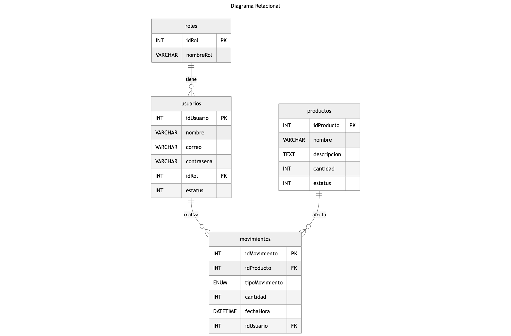

# [Evaluación Técnica - Castores 2024](https://github.com/daniel110066/GRUPOCASTORES---TECHNICAL-INTERVIEW.git)

## Autor

- **Nombre:** Daniel Hidalgo Badillo  
- **Correo:** hidalgobadillodaniel@gmail.com 
- **Fecha de entrega:** 2025/05/09

## [📄 Instrucciones de la Evaluación Técnica](./Evaluación%20Técnica%20Castores%202024%20-%20Desarrollador.pdf)

## Contenido

1. [**Parte 1:** *CONOCIMIENTOS SQL*](#1-conocimientos-sql)
2. [**Parte 2:** *EJERCICIO PRÁCTICO: BD*](#2-ejercicio-práctico-bd)
3. [**Parte 3:** *EJERCICIO PRÁCTICO: DESARROLLO*](#3-ejercicio-práctico-desarrollo)
4. [**Parte 4:** *DOCUMENTACIÓN*](#4-documentación)

## 1. CONOCIMIENTOS SQL

**1.1** ¿Cuál es el funcionamiento general de la sentencia `JOIN`?  
> Su función es combinar registros de dos o más tablas, usando una regla lógica que normalmente es una relación entre una `PRIMARY KEY` y una `FOREIGN KEY`. Creando un conjunto de datos relacionados con columnas de otras tablas, permitiendo visualizar o acceder de forma clara a una tabla más completa según la consulta.

**1.2** ¿Cuáles son los tipos de `JOIN` y cómo funcionan?  
> Son 4 tipos principales: `INNER JOIN`, `FULL OUTER JOIN`, `RIGHT JOIN` y `LEFT JOIN`. Cada una tiene una función:
> - **INNER JOIN** → Devuelve solo las filas que tienen coincidencias en ambas tablas según la condición establecida.
> - **FULL OUTER JOIN** → Devuelve todas las filas de ambas tablas, aunque no haya coincidencias.
> - **RIGHT JOIN** → Devuelve todas las filas de la tabla derecha y las coincidencias de la tabla izquierda.
> - **LEFT JOIN** → Devuelve todas las filas de la tabla izquierda y las coincidencias de la tabla derecha.

**1.3** ¿Qué es un `TRIGGER` y para qué sirve?  
> Un *TRIGGER* es una función activadora que responde a un evento específico en una base de datos, como operaciones de `INSERT`, `UPDATE` o `DELETE`. Se utiliza para validar datos, generar registros automáticos o sincronizar tablas, contribuyendo a mantener la integridad de la base de datos.

**1.4** ¿Qué es un `STORED PROCEDURE`?  
> Un *STORE PROCEDURE* o *PROCEDIMIENTO ALMACENADO* es un conjunto ejecutable de instrucciones SQL predefinidas y almacenadas en la base de datos. Se utiliza para encapsular lógica compleja o repetitiva, y ofrece el beneficio adicional de permitir su reutilización sin exponer directamente el acceso a la base de datos, lo que es de grán ayuda en temas de seguridad.

**1.5** Consulta para traer todos los productos que tengan una venta.
```sql
SELECT DISTINCT productos.* from productos
JOIN ventas ON productos.idProducto = ventas.idProducto;
```

**1.6** Traer todos los productos que tengan ventas y la cantidad total de productos vendidos.
```sql
SELECT productos.idProducto, productos.nombre, SUM(ventas.cantidad) AS cantidad_total FROM productos
JOIN ventas ON productos.idProducto = ventas.idProducto GROUP BY productos.idProducto;
```

**1.7** Traer todos los productos (independientemente de si tienen ventas o no) y la suma total ($) vendida por producto.
```sql
SELECT productos.idProducto, productos.nombre, COALESCE(SUM(ventas.cantidad*productos.precio), 0)
AS suma_total FROM productos
LEFT JOIN ventas ON productos.idProducto = ventas.idProducto GROUP BY productos.idProducto;
```

## 2. EJERCICIO PRÁCTICO: BD

**2.1** Crea un `diagrama relacional` de BD para el escenario descrito anteriormente. 


**2.2** Hacer el `script` para crear las tablas del punto anterior
> [➡️ script_base_de_datos.sql](./SCRIPTS/script_base_de_datos.sql)

## 3. EJERCICIO PRÁCTICO: DESARROLLO

**3.1**  Crear una aplicación WEB para el escenario que se planteó previamente.
- Preferiblemente utilizar el diseño `MVC` para su desarrollo.
- Preferiblemente utilizar `JAVA`.
- Utilizar `MySQL` o SQLServer.
> Para este proyecto decidí usar ***Spring Boot*** como framework ***MVC*** porque me parece una de las mejores opciones si estoy trabajando con Java. Además, facilita bastante la conexión con ***MySQL*** y me permite manejar un esquema local de forma sencilla, lo que hace que todo el desarrollo sea mucho más ágil.

## 4. DOCUMENTACIÓN

**4.1** Se   necesita   que   el   código   se   suba   en   un   repositorio   de  `GITHUB`  y   esté   público   para   que   pueda   ser
descargado.
> 👍 listo -> [GITHUB](https://github.com/daniel110066/GRUPOCASTORES---TECHNICAL-INTERVIEW.git)

**4.2** Los scripts generados para la evaluación deben encontrarse en una carpeta llamada  `SCRIPTS`, dentro del
repositorio de GITHUB.
> 👍 listo -> [SCRIPTS](./SCRIPTS/)

**4.3** Dentro del repositorio, debe haber un  README.md  donde se especifiquen los datos relevantes para el
desarrollo:
> - **IDE utilizado:** Visual Studio Code
> - **Lenguaje de programación:** Java 17
> - **DBMS utilizado:** MySQL 8

#### Pasos para correr la aplicación

1. **Clonar el proyecto desde GitHub:**

```bash
git clone https://github.com/daniel110066/GRUPOCASTORES---TECHNICAL-INTERVIEW.git
cd GRUPOCASTORES---TECHNICAL-INTERVIEW
```

2. **Crear la base de datos:**

Usa el siguiente script SQL ubicado en el repositorio para generar el esquema:

```bash
./SCRIPTS/script_base_de_datos.sql
```

Puedes ejecutarlo desde MySQL Workbench, consola o cualquier cliente compatible.

3. **Configurar acceso a MySQL:**

Edita el archivo [application.properties](./SCRIPTS/scripts_desarrollo/src/main/resources/application.properties) y coloca tus credenciales para la base de datos:
```bash
./SCRIPTS/scripts_desarrollo/src/main/resources/application.properties
```
```properties
spring.datasource.username=TU_USUARIO
spring.datasource.password=TU_CONTRASEÑA
```

4. **Asegúrate de tener instalado:**

- Java 17+

5. **Moverte al proyecto Spring Boot:**

```bash
cd ./SCRIPTS/scripts_desarrollo
```

6. **Construir el proyecto:**

```bash
./mvnw clean install
```

7. **Ejecutar la aplicación:**

```bash
./mvnw spring-boot:run
```

8. **Abrir en navegador:**

Visita [http://localhost:8080](http://localhost:8080) para acceder a la aplicación.

**4.4**Haga un video donde se muestren los siguientes escenarios dentro de su aplicación:
- Mostrar que los usuarios con el rol de Administrador pueden:
    - Iniciar de sesión.
    - Visualizar el histórico y filtrarlo.
    - Registrar productos nuevos.
    - Dar de baja productos.
    - Reactivar productos.
    - Agregar existencias a los productos.
    - No pueden acceder al módulo para salida de material. 
> [video 1](./videos/video1.mov)

- Mostrar que los usuarios con el rol de Almacenista pueden:
    - Iniciar de sesión.
    - No pueden visualizar el histórico.
    - Solo pueden visualizar el módulo de inventario. 
    - Puede acceder al módulo para salida de material y sacar material.
> [video 2](./videos/video2.mov)

- Mostrar los mensajes de error que se consideraron en el escenario planteado.
> [video 3](./videos/video3.mov)